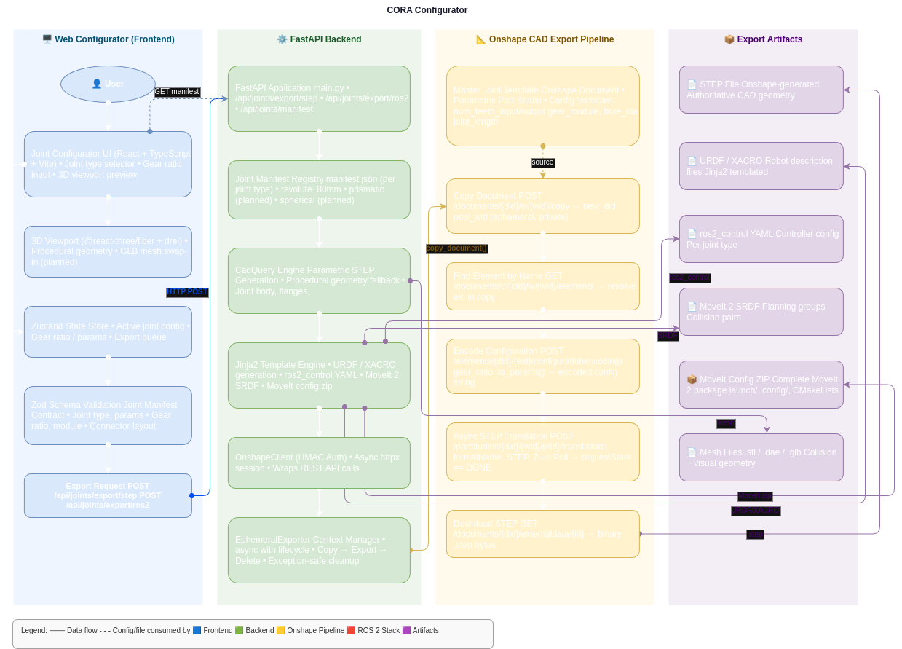

# CORA — Cobot Configurator

> Modular cobot joint configurator with 3D viewer, URDF/XACRO export, MoveIt 2 config generation, and parametric STEP file generation via CadQuery and the Onshape API.



---

## Stack

| Layer | Tech |
|---|---|
| Frontend | React + TypeScript + Vite |
| 3D Viewer | @react-three/fiber + drei |
| State | Zustand |
| Schema validation | Zod (joint manifest contract) |
| Backend | FastAPI (Python) |
| Parametric CAD (fallback) | CadQuery → STEP |
| Authoritative CAD export | Onshape REST API → STEP |
| File templating | Jinja2 → URDF / XACRO / SRDF / YAML |
| ROS 2 | Jazzy + ros2_control + MoveIt 2 + Gazebo |

---

## Architecture Overview

CORA is a monorepo with three concerns:

1. **Web Configurator** — users compose a robot from a library of modular joints, set parameters (gear ratio, bore diameter, module), and request exports.
2. **FastAPI Backend** — orchestrates CAD generation, file templating, and the Onshape export pipeline. Adding a new joint type requires only dropping a folder; no code changes needed.
3. **Onshape CAD Pipeline** — each user export spins up an ephemeral copy of the master joint document, applies the requested configuration, exports a STEP file, then deletes the copy. The master template is never modified.

See [`assets/pipeline.png`](assets/DOC/pipeline.png) for the full system diagram (also available as [`assets/pipeline.drawio`](assets/DOC/pipeline.drawio) for editing).

---

## Quick Start

### Frontend only (no backend needed — uses mock data)

```bash
cd apps/frontend
npm install
npm run dev
# Open http://localhost:5173
```

### Full stack

```bash
# Terminal 1 — frontend
cd apps/frontend && npm install && npm run dev

# Terminal 2 — backend
cd apps/backend
pip install -r requirements.txt
uvicorn main:app --reload --port 8000
```

### Docker

```bash
docker-compose up
```

### Onshape STEP export (optional)

STEP export from the UI requires Onshape API credentials. Without them, CadQuery is used as a fallback for parametric geometry.

```bash
export ONSHAPE_ACCESS_KEY=your_access_key
export ONSHAPE_SECRET_KEY=your_secret_key
```

Generate keys at [dev-portal.onshape.com/keys](https://dev-portal.onshape.com/keys). See [Onshape CAD Pipeline](#onshape-cad-pipeline) below for the full setup.

---

## Project Structure

```
cobot-configurator/
├── apps/
│   ├── frontend/                        # React + R3F viewer
│   │   └── src/
│   │       ├── components/
│   │       │   ├── viewer/              # 3D viewport, joint meshes
│   │       │   ├── panels/              # Library panel, properties panel
│   │       │   └── ui/                  # Topbar
│   │       ├── store/                   # Zustand robot state
│   │       ├── types/                   # Zod schemas (manifest contract)
│   │       └── joints/                  # Mock data for offline dev
│   └── backend/                         # FastAPI
│       ├── routers/                     # /api/joints, /api/export
│       ├── services/                    # URDF, SRDF, MoveIt, ros2_control generators
│       │   ├── onshape_client.py        # HMAC-authenticated async Onshape client
│       │   ├── ephemeral_pipeline.py    # Copy → configure → export → delete lifecycle
│       │   └── step_exporter.py        # gear_ratio_to_params(), config encoding
│       └── models/                      # Pydantic schemas
├── packages/
│   └── joint-library/                   # Joint manifests + meshes + CadQuery scripts
│       └── joints/
│           └── revolute_80mm/           # Reference joint implementation
│               ├── manifest.json        # ← the extensibility contract
│               ├── revolute_80mm.glb    # Visual mesh
│               ├── revolute_80mm_collision.glb
│               └── revolute_80mm.py    # CadQuery parametric STEP generator
└── assets/
    ├── pipeline.png                     # Full system pipeline diagram
    └── pipeline.drawio                  # Editable source (diagrams.net)
```

---

## Adding a New Joint

1. Create a folder: `packages/joint-library/joints/your_joint_name/`
2. Add `manifest.json` (copy from `revolute_80mm` and edit)
3. Add `your_joint.glb` (visual mesh) and `your_joint_collision.glb`
4. Add `your_joint.py` (CadQuery parametric script)
5. Restart the backend — the joint appears automatically in the UI

**That's it. No code changes required.**

The `manifest.json` is the extensibility contract. Its Zod schema (`src/types/`) is the single source of truth for what a joint must declare — joint type, kinematic parameters, connector layout, gear ratio range, and Onshape document references for authoritative CAD export.

---

## Onshape CAD Pipeline

CORA uses the Onshape REST API to generate authoritative STEP files from fully parametric master joint documents. The pipeline is designed so the master template is never modified by user requests.

### How it works

```
User requests Onshape export
        │
        ▼
POST /documents/{did}/w/{wid}/copy          → Copy Onshape template doc
        │
        ▼
DELETE /documents/{ephemeral_did}           → Delete Unused joints/parts
        │
        ▼
       (?)                                  → Assemble robot according to robot config json
        │
        ▼
       (?)                                  -> share/link to onshape doc
```

### Configuration variables

Each master joint document exposes these Onshape Configuration Variables:

| Variable | Description |
|---|---|
| `num_teeth_input` | Driving gear tooth count |
| `num_teeth_output` | Driven gear tooth count |
| `gear_module` | Gear module in mm (1.0 / 1.5 / 2.0) |
| `bore_diameter` | Shaft bore in mm |
| `joint_length` | Axial joint length in mm |

`gear_ratio_to_params()` converts a float ratio (e.g. `5.0`) to the nearest valid integer tooth-count pair within physical constraints.

<!-- ### When you don't need the copy/delete pipeline

If all parameters are exposed as Onshape Configuration Variables, the config is applied per-request as a stateless microversion parameter — the original document is never touched and concurrent users can't interfere. The ephemeral copy pipeline is used when you need to modify feature variables directly in the feature tree, or for future "save to my Onshape account" functionality. -->

---

## Export Artifacts

Each configuration export produces a zip containing:

| File | Generator | Consumed by |
|---|---|---|
| `robot.step` | Onshape API / CadQuery | Manufacturing, CAM |
| `robot.urdf.xacro` | Jinja2 | ROS 2, Gazebo |
| `ros2_control.yaml` | Jinja2 | ros2_control hardware interface |
| `robot.srdf` | Jinja2 | MoveIt 2 planning groups |
| `moveit_config/` | Jinja2 | Full MoveIt 2 package (launch + config) |
| `meshes/` | CadQuery / GLB | URDF visual + collision geometry |

All geometry follows [REP-103](https://www.ros.org/reps/rep-0103.html) conventions: Z-up, metres, radians.

---

### API limits

Onshape enforces annual API call limits per account (enforced from 2025). The ephemeral pipeline costs approximately 7–15 calls per export (including translation polling).

---

# Notes
1. Robot Configs: Simple overview of all existing project configs
2. Configurator: Actual robot configurator window
3. Export: For selecting export options and artifacts, should also display follow up steps
4. Motor and joint setup: Hardware setup from the script created in the other board. Should also run some tests
5. Robot assembly and setup: Runs a setup and test script to see if everything is there, like all the joints, homing sequence etc.